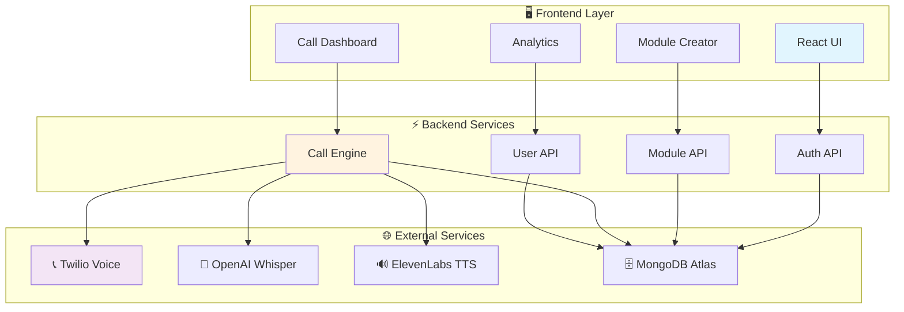
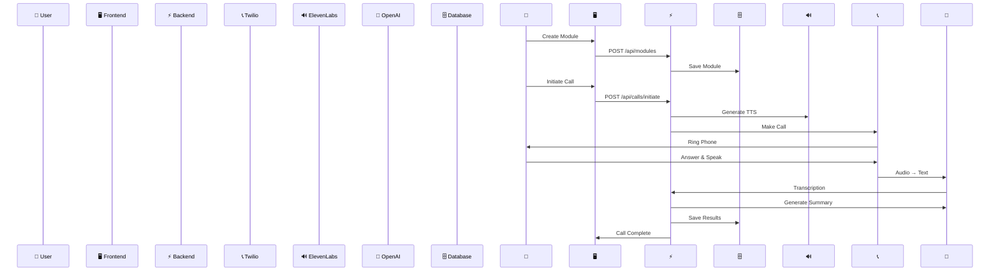

<div align="center">
  

  # Vok.AI
>>>>>>> 71d8eea (feat: Implement voice preview caching system with direct MP3 file access)
  **🎙️ Voice-powered communication & productivity platform**
  
  *Automated calling with AI-powered transcription & analytics*
  
  [](https://github.com/AbhigyanRaj/Vok.AI)
  [](https://reactjs.org/)
  [](https://nodejs.org/)
  [](https://www.mongodb.com/)
  
  Built by [Abhigyan Raj](https://github.com/AbhigyanRaj) | IIIT Delhi
</div>

---

## 🎯 What is Vok.AI?

Vok.AI transforms business communication by automating voice calls with AI. Create custom call scripts, make outbound calls, and get intelligent insights - all through an intuitive web interface.

### ✨ Key Features

| Feature | Description |
|---------|-------------|
| 🎙️ **Voice Modules** | Create custom call scripts with multiple questions |
| 📞 **Auto Calling** | Automated outbound calls via Twilio integration |
| 🤖 **AI Transcription** | Real-time speech-to-text using OpenAI Whisper |
| 📊 **Smart Analytics** | AI-powered call summaries and insights |
| 💰 **Token System** | Pay-per-call billing (5 tokens per call) |
| 🔐 **Secure Auth** | Google OAuth with JWT tokens |

---

## 🏗️ System Architecture



---

## 🚀 Quick Start

### 📋 Prerequisites

- **Node.js** v18+
- **MongoDB Atlas** account
- **Twilio** account
- **OpenAI** API key
- **Google OAuth** credentials

### ⚡ Installation

```bash
# 1️⃣ Clone the repository
git clone https://github.com/AbhigyanRaj/Vok.AI.git
cd Vok.AI

# 2️⃣ Backend setup
cd backend
npm install
cp env.example .env
# Configure your .env file
npm run dev

# 3️⃣ Frontend setup (new terminal)
cd ../frontend
npm install
npm run dev
```

### 🔧 Environment Setup

<details>
<summary><b>Backend Environment Variables</b></summary>

```env
# Server Configuration
PORT=5001
NODE_ENV=development
BASE_URL=http://localhost:5001

# Database
MONGODB_URI=your_mongodb_atlas_connection_string

# Authentication
JWT_SECRET=your_jwt_secret_here
GOOGLE_CLIENT_ID=your_google_client_id
GOOGLE_CLIENT_SECRET=your_google_client_secret

# Twilio Integration
TWILIO_ACCOUNT_SID=your_twilio_account_sid
TWILIO_AUTH_TOKEN=your_twilio_auth_token
TWILIO_PHONE_NUMBER=your_twilio_phone_number

# AI Services
OPENAI_API_KEY=your_openai_api_key
ELEVENLABS_API_KEY=your_elevenlabs_api_key
```
</details>

<details>
<summary><b>Frontend Environment Variables</b></summary>

```env
VITE_API_URL=http://localhost:5001/api
VITE_GOOGLE_OAUTH_CLIENT_ID=your_google_oauth_client_id
```
</details>

---

## 🛠️ Tech Stack

<div align="center">

### Frontend


### Backend


### Services


</div>

---

## 📊 Call Flow Diagram



---

## 📁 Project Structure

```
Vok.AI/
├── 🖥️ frontend/                 # React Application
│   ├── src/
│   │   ├── components/         # UI Components
│   │   │   ├── Hero.tsx       # Landing Page
│   │   │   ├── ModulesPage.tsx # Module Management
│   │   │   ├── AnalyticsPage.tsx # Call Analytics
│   │   │   └── ui/            # Reusable Components
│   │   ├── contexts/          # React Contexts
│   │   ├── lib/               # Utilities & API
│   │   └── App.tsx            # Main App
│   └── package.json
│
├── ⚡ backend/                  # Node.js API Server
│   ├── src/
│   │   ├── config/            # Service Configurations
│   │   ├── models/            # Database Schemas
│   │   │   ├── User.js        # User Model
│   │   │   ├── Module.js      # Call Module Model
│   │   │   └── Call.js        # Call Record Model
│   │   ├── routes/            # API Endpoints
│   │   ├── middleware/        # Auth & Security
│   │   └── server.js          # Express Server
│   └── package.json
│
└── 📄 README.md               # This File
```

---

## 🔌 API Reference

### 🔐 Authentication
| Method | Endpoint | Description |
|--------|----------|-------------|
| `POST` | `/api/auth/google` | Google OAuth login |
| `GET` | `/api/auth/me` | Get current user |
| `POST` | `/api/auth/buy-tokens` | Purchase tokens |

### 📋 Module Management
| Method | Endpoint | Description |
|--------|----------|-------------|
| `GET` | `/api/modules` | Get user modules |
| `POST` | `/api/modules` | Create new module |
| `PUT` | `/api/modules/:id` | Update module |
| `DELETE` | `/api/modules/:id` | Delete module |

### 📞 Call Processing
| Method | Endpoint | Description |
|--------|----------|-------------|
| `POST` | `/api/calls/initiate` | Start voice call |
| `GET` | `/api/calls/history` | Get call history |
| `POST` | `/api/calls/webhook` | Twilio webhook |

---

## 🗄️ Database Schema

### 👤 Users Collection
```javascript
{
  email: String (unique),
  name: String,
  tokens: Number (default: 100),
  googleId: String,
  totalCallsMade: Number,
  subscription: 'free' | 'basic' | 'premium'
}
```

### 📋 Modules Collection
```javascript
{
  userId: ObjectId,
  name: String,
  type: 'loan' | 'credit_card' | 'custom',
  questions: [{
    question: String,
    order: Number,
    required: Boolean
  }],
  totalCalls: Number,
  successfulCalls: Number
}
```

### 📞 Calls Collection
```javascript
{
  userId: ObjectId,
  moduleId: ObjectId,
  customerName: String,
  phoneNumber: String,
  status: String,
  duration: Number,
  transcription: String,
  summary: String,
  tokensUsed: Number (default: 5)
}
```

---

## 🎤 Voice System

### 🔊 Smart Hybrid TTS
| Priority | Use Case | Service |
|----------|----------|---------|
| 🔴 **High** | Greeting, First Question, Outro | ElevenLabs |
| 🟡 **Medium** | Key Questions | ElevenLabs (if available) |
| 🟢 **Low** | Confirmations, Decline | Twilio TTS |

### ⚡ Rate Limits
- **Per Call**: 3 ElevenLabs requests max
- **Per Minute**: 5 requests max  
- **Per Hour**: 20 requests max
- **Fallback**: Automatic Twilio TTS

---

## 🚀 Deployment

### 🌐 Production Setup

| Service | Platform | URL |
|---------|----------|-----|
| **Backend** | Render.com | `https://vok-ai.onrender.com` |
| **Frontend** | Vercel | `https://vok-ai.vercel.app` |
| **Database** | MongoDB Atlas | Cloud hosted |

### 🔧 Environment Variables
```env
NODE_ENV=production
BASE_URL=https://vok-ai.onrender.com
FRONTEND_URL=https://vok-ai.vercel.app
```

---

## 🧪 Testing & Development

### 🔍 Health Check Endpoints
```bash
# General health
curl https://vok-ai.onrender.com/api/health

# Database status  
curl https://vok-ai.onrender.com/api/db/status

# Voice system health
curl https://vok-ai.onrender.com/api/calls/voices/health
```

### 🛠️ Local Development with ngrok
```bash
# Install ngrok
brew install ngrok

# Start backend
npm run dev

# Expose to internet (new terminal)
ngrok http 5001

# Update BASE_URL with ngrok URL
export BASE_URL=https://abc123.ngrok.io
```

---

## 🐛 Troubleshooting

<details>
<summary><b>🚨 Common Issues & Solutions</b></summary>

### 📞 Twilio Trial Account
- **Issue**: Can only call verified numbers
- **Solution**: Add numbers to "Verified Caller IDs" in Twilio Console

### 🔊 Audio Not Playing
- **Issue**: No audio during calls
- **Solution**: Ensure `BASE_URL` is publicly accessible (use ngrok locally)

### 🗄️ Database Connection
- **Issue**: MongoDB connection fails
- **Solution**: Check connection string and IP whitelist in Atlas

### 🤖 ElevenLabs Errors
- **Issue**: TTS generation fails
- **Solution**: Check API key and account limits (auto-fallback to Twilio)

</details>

---

## 🔒 Security Features

- 🛡️ **JWT Authentication** - Secure token-based auth
- 🔐 **Google OAuth** - Trusted authentication
- 🚦 **Rate Limiting** - API abuse prevention
- 🌐 **CORS Protection** - Cross-origin security
- 🔒 **Helmet Security** - HTTP security headers
- ✅ **Input Validation** - Request sanitization

---

## 🤝 Contributing

This project is actively maintained. For collaboration:

1. 🍴 Fork the repository
2. 🌟 Create a feature branch
3. 💻 Make your changes
4. 🧪 Test thoroughly
5. 📝 Submit a pull request

---

## 📄 License

This project is licensed under the **MIT License**.

---

<div align="center">
  
  ### 🎯 Simple. Fast. Voice-first.
  
  *Built with modern web technologies for the future of communication*
  
  [](https://github.com/AbhigyanRaj)
  [](https://linkedin.com/in/abhigyanraj)
  
  **⭐ Star this repo if you find it useful!**
  
</div>
