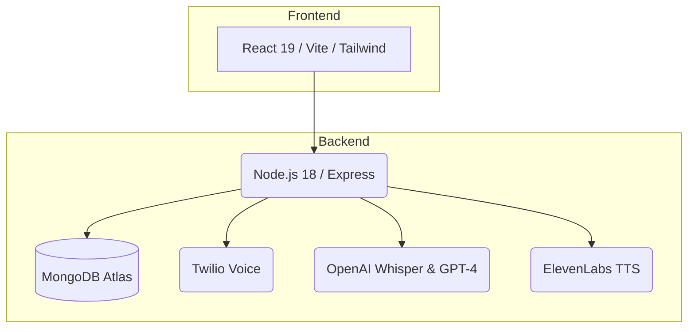
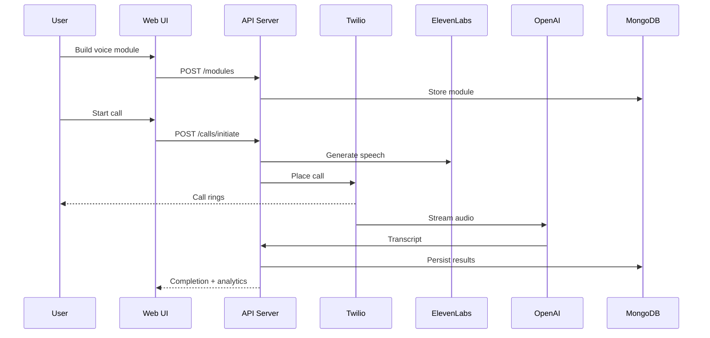

<div align="center">
  
  
  # Vok.AI
  
  **Voice-powered communication & productivity platform**
  
  Automated calling with AI-driven transcription and analytics
  
  [](https://github.com/AbhigyanRaj/Vok.AI)
  [](https://reactjs.org/)
  [](https://nodejs.org/)
  [](https://www.mongodb.com/)
</div>

---

## Overview

**Vok.AI** automates high-volume phone outreach for businesses. Build configurable voice modules, place calls at scale, and receive AI-driven transcripts, summaries and analytics in real time—all from a single dashboard.

### Features

- Visual module builder with multi-step question flows
- Automated outbound calling via Twilio
- Real-time speech-to-text transcription (OpenAI Whisper)
- GPT-based summaries and sentiment analytics
- Token-based billing (5 tokens per call)
- Google OAuth with JWT authentication

---

## System architecture



---

## Quick start

### Prerequisites

- Node.js 18+
- MongoDB Atlas account
- Twilio account with phone number
- OpenAI API key
- Google OAuth credentials

### Installation

```bash
# Clone repository
git clone https://github.com/AbhigyanRaj/Vok.AI.git && cd Vok.AI

# Backend setup
cd backend
npm install
cp env.example .env  # Edit .env with your credentials
npm run dev

# Frontend setup (new terminal)
cd ../frontend
npm install
npm run dev
```

The API runs on `http://localhost:5001`; the web app on `http://localhost:5173` by default.

### Environment variables

<details>
<summary>Backend (.env)</summary>

```env
PORT=5001
NODE_ENV=development
BASE_URL=http://localhost:5001

MONGODB_URI=mongodb+srv://<user>:<pass>@cluster.mongodb.net/vokai

JWT_SECRET=change_me
GOOGLE_CLIENT_ID=xxx.apps.googleusercontent.com
GOOGLE_CLIENT_SECRET=your_secret

TWILIO_ACCOUNT_SID=ACxxxxxxxxxxxxxxxxxxxxx
TWILIO_AUTH_TOKEN=your_auth_token
TWILIO_PHONE_NUMBER=+15551234567

OPENAI_API_KEY=sk-...
ELEVENLABS_API_KEY=sk_...
```
</details>

<details>
<summary>Frontend (.env)</summary>

```env
VITE_API_URL=http://localhost:5001/api
VITE_GOOGLE_OAUTH_CLIENT_ID=xxx.apps.googleusercontent.com
```
</details>

---

## Tech stack

| Layer      | Technologies                                   |
|------------|------------------------------------------------|
| Frontend   | React 19, TypeScript, Vite, Tailwind CSS      |
| Backend    | Node.js 18, Express, Mongoose                 |
| Services   | Twilio Voice, OpenAI, ElevenLabs, Google OAuth |
| Database   | MongoDB Atlas                                  |

---

## Operational flow



---

## API endpoints

### Authentication
| Method | Endpoint | Description |
|--------|----------|-------------|
| `POST` | `/api/auth/google` | Google OAuth login |
| `GET` | `/api/auth/me` | Get current user |
| `POST` | `/api/auth/buy-tokens` | Purchase tokens |

### Module management
| Method | Endpoint | Description |
|--------|----------|-------------|
| `GET` | `/api/modules` | Get user modules |
| `POST` | `/api/modules` | Create new module |
| `PUT` | `/api/modules/:id` | Update module |
| `DELETE` | `/api/modules/:id` | Delete module |

### Call processing
| Method | Endpoint | Description |
|--------|----------|-------------|
| `POST` | `/api/calls/initiate` | Start voice call |
| `GET` | `/api/calls/history` | Get call history |
| `POST` | `/api/calls/webhook` | Twilio webhook handler |

---

## Database schema

### Users
```javascript
{
  email: String (unique),
  name: String,
  tokens: Number (default: 100),
  googleId: String,
  totalCallsMade: Number,
  subscription: 'free' | 'basic' | 'premium'
}
```

### Modules
```javascript
{
  userId: ObjectId,
  name: String,
  type: 'loan' | 'credit_card' | 'custom',
  questions: [{
    question: String,
    order: Number,
    required: Boolean
  }],
  totalCalls: Number,
  successfulCalls: Number
}
```

### Calls
```javascript
{
  userId: ObjectId,
  moduleId: ObjectId,
  customerName: String,
  phoneNumber: String,
  status: String,
  duration: Number,
  transcription: String,
  summary: String,
  tokensUsed: Number (default: 5)
}
```

---

## Voice system

### Hybrid TTS strategy
| Priority | Use case | Service |
|----------|----------|---------|
| High | Greeting, first question, outro | ElevenLabs |
| Medium | Key questions | ElevenLabs (if available) |
| Low | Confirmations, decline | Twilio TTS |

### Rate limits
- Per call: 3 ElevenLabs requests max
- Per minute: 5 requests max
- Per hour: 20 requests max
- Fallback: Automatic Twilio TTS

---

## Deployment

| Component | Platform | URL |
|-----------|----------|-----|
| Backend   | Render   | https://vok-ai.onrender.com |
| Frontend  | Vercel   | https://vok-ai.vercel.app |
| Database  | MongoDB Atlas | Cloud hosted |

### Production environment variables
```env
NODE_ENV=production
BASE_URL=https://vok-ai.onrender.com
FRONTEND_URL=https://vok-ai.vercel.app
```

---

## Development

### Health check endpoints
```bash
# General health
curl https://vok-ai.onrender.com/api/health

# Database status
curl https://vok-ai.onrender.com/api/db/status

# Voice system health
curl https://vok-ai.onrender.com/api/calls/voices/health
```

### Local development with ngrok
```bash
# Install ngrok
brew install ngrok

# Start backend
npm run dev

# Expose to internet (new terminal)
ngrok http 5001

# Update BASE_URL with ngrok URL
export BASE_URL=https://abc123.ngrok.io
```

---

## Security

- JWT authentication with secure token-based auth
- Google OAuth for trusted authentication
- Rate limiting to prevent API abuse
- CORS protection for cross-origin security
- Helmet security headers
- Input validation and request sanitization

---

## Contributing

Contributions are welcome. Please fork the repository, create a feature branch, commit your changes and open a pull request.

---

## License

This project is licensed under the MIT License.

---

<div align="center">
  
  **Built by [Abhigyan Raj](https://github.com/AbhigyanRaj) | IIIT Delhi**
  
  [](https://github.com/AbhigyanRaj)
  [](https://linkedin.com/in/abhigyanraj)
  
</div>
