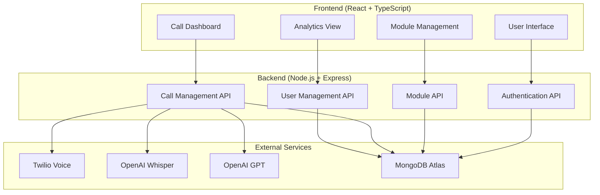
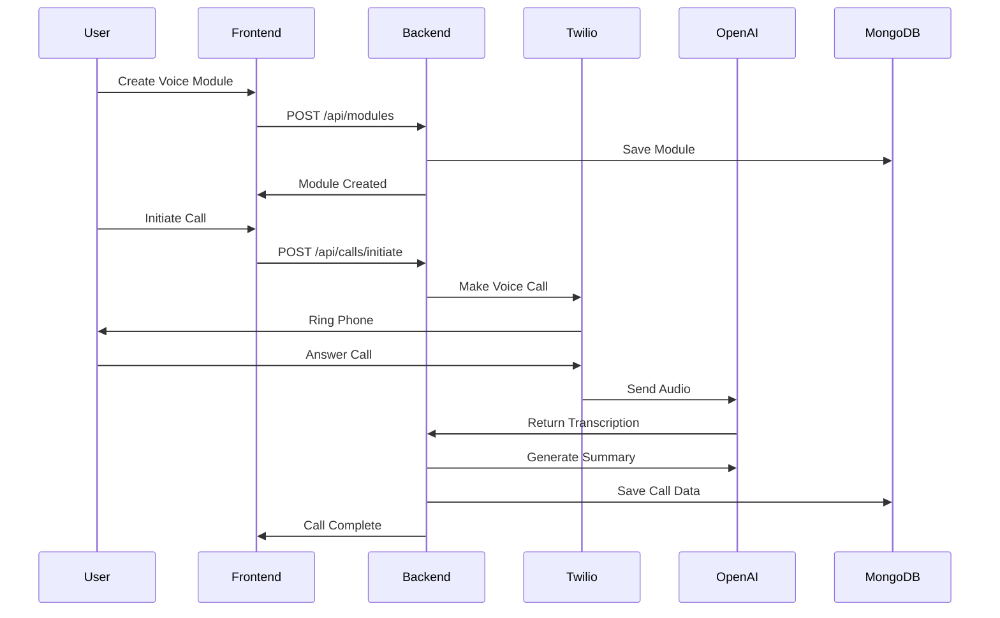

<!-- Vok.AI Logo -->
<p align="center">
  
</p>

# Vok.AI

**Voice-powered communication & productivity platform**

> **Status: Under Development**  
> Built by [Abhigyan](https://github.com/AbhigyanRaj) | IIIT Delhi

---

## Project Overview

Vok.AI is a comprehensive voice automation platform that enables businesses to create custom call scripts, automate outbound calls, and analyze call responses using AI. The platform combines voice technology with AI-powered transcription and analytics to streamline customer communication workflows.

## Architecture


```mermaid
graph TB
    subgraph "Frontend (React + TypeScript)"
        A[User Interface]
        B[Module Management]
        C[Call Dashboard]
        D[Analytics View]
    end
    
    subgraph "Backend (Node.js + Express)"
        E[Authentication API]
        F[Module API]
        G[Call Management API]
        H[User Management API]
    end
    
    subgraph "External Services"
        I[Twilio Voice]
        J[OpenAI Whisper]
        K[OpenAI GPT]
        L[MongoDB Atlas]
    end
    
    A --> E
    B --> F
    C --> G
    D --> H
    
    G --> I
    G --> J
    G --> K
    E --> L
    F --> L
    G --> L
    H --> L
```

## Features

### Core Functionality
- **Voice Module Creation**: Create custom call scripts with multiple questions
- **Automated Calling**: Make outbound calls using Twilio integration
- **AI Transcription**: Real-time audio transcription using OpenAI Whisper
- **Smart Analytics**: AI-powered call summaries and insights
- **Token-Based Billing**: Pay-per-call system with token management

### User Experience
- **Real-time Module Management**: Edit, reorder, and manage call scripts
- **Call History**: Track all calls with detailed analytics
- **Responsive Design**: Works seamlessly across all devices
- **Google OAuth**: Secure authentication system

## Tech Stack

### Frontend
- **React 19** - Modern UI framework
- **TypeScript** - Type-safe development
- **Vite** - Fast build tool
- **Tailwind CSS** - Utility-first styling
- **React Router** - Client-side routing

### Backend
- **Node.js** - Runtime environment
- **Express.js** - Web framework
- **MongoDB** - NoSQL database
- **JWT** - Authentication tokens
- **bcryptjs** - Password hashing

### External Services
- **Twilio** - Voice calling API
- **OpenAI Whisper** - Audio transcription
- **OpenAI GPT** - Call summarization
- **MongoDB Atlas** - Cloud database

## System Flow


```mermaid
sequenceDiagram
    participant U as User
    participant F as Frontend
    participant B as Backend
    participant T as Twilio
    participant O as OpenAI
    participant DB as MongoDB

    U->>F: Create Voice Module
    F->>B: POST /api/modules
    B->>DB: Save Module
    B->>F: Module Created
    
    U->>F: Initiate Call
    F->>B: POST /api/calls/initiate
    B->>T: Make Voice Call
    T->>U: Ring Phone
    U->>T: Answer Call
    T->>O: Send Audio
    O->>B: Return Transcription
    B->>O: Generate Summary
    B->>DB: Save Call Data
    B->>F: Call Complete
```

## Development Status

### Completed
- [x] Frontend UI/UX design
- [x] Module creation and management
- [x] User authentication system
- [x] Token-based billing UI
- [x] Responsive design implementation

### In Progress
- [ ] Backend API development
- [ ] Twilio integration
- [ ] OpenAI integration
- [ ] Database schema implementation
- [ ] Call analytics dashboard

### Planned
- [ ] Voice call functionality
- [ ] Real-time transcription
- [ ] AI-powered insights
- [ ] Advanced analytics
- [ ] Multi-tenant support

## Getting Started

### Prerequisites
- Node.js (v18+)
- MongoDB
- Twilio Account
- OpenAI API Key

### Frontend Setup
```bash
cd frontend
npm install
npm run dev
```

### Backend Setup
```bash
cd backend
npm install
cp env.example .env
# Configure environment variables
npm run dev
```

## Project Structure

```
Vok.AI/
├── frontend/                 # React frontend
│   ├── src/
│   │   ├── components/      # UI components
│   │   ├── contexts/        # React contexts
│   │   ├── lib/            # Utilities
│   │   └── App.tsx         # Main app
│   └── package.json
├── backend/                  # Node.js backend
│   ├── src/
│   │   ├── config/         # Configuration
│   │   ├── models/         # Database models
│   │   ├── routes/         # API routes
│   │   └── middleware/     # Auth middleware
│   └── package.json
└── README.md
```

## Environment Variables

### Frontend
```env
VITE_API_URL=http://localhost:5000/api
```

### Backend
```env
PORT=5000
MONGODB_URI=mongodb://localhost:27017/vokai
JWT_SECRET=your_jwt_secret
TWILIO_ACCOUNT_SID=your_twilio_sid
TWILIO_AUTH_TOKEN=your_twilio_token
OPENAI_API_KEY=your_openai_key
```

## Contributing

This project is currently under active development. For questions or collaboration, please reach out to [Abhigyan](https://github.com/AbhigyanRaj).

## License

This project is licensed under the MIT License.

---

<p align="center">
  <b>Simple. Fast. Voice-first.</b><br>
  <em>Built with modern web technologies for the future of communication.</em>
</p> 