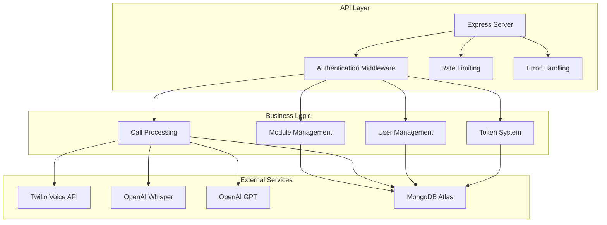

# Vok.AI Backend API

**Node.js backend for Vok.AI voice automation platform**

> **Status: Under Development** 🚧  
> Built with ❤️ by [Abhigyan](https://github.com/AbhigyanRaj) | IIIT Delhi

---

## 🎯 Overview

This is the backend API for Vok.AI, a comprehensive voice automation platform. The backend handles user authentication, module management, voice call processing, and AI-powered transcription and analytics. Built with Node.js, Express, and MongoDB, it provides a robust foundation for voice automation workflows.

## 🏗️ Architecture



## 🚧 Development Status

### ✅ Completed
- [x] Express server setup with middleware
- [x] MongoDB connection and models
- [x] JWT authentication system
- [x] Basic API route structure
- [x] Environment configuration
- [x] Security middleware (helmet, cors, rate limiting)

### 🔄 In Progress
- [ ] Twilio voice call integration
- [ ] OpenAI Whisper transcription
- [ ] OpenAI GPT summarization
- [ ] Call webhook processing
- [ ] Real-time call status updates

### 📋 Planned
- [ ] Advanced analytics endpoints
- [ ] Multi-tenant support
- [ ] Call recording management
- [ ] Performance optimization
- [ ] Comprehensive testing suite

## 🛠️ Tech Stack

### Core Technologies
- **Node.js** - Runtime environment
- **Express.js** - Web framework
- **MongoDB** - NoSQL database
- **Mongoose** - MongoDB ODM

### Authentication & Security
- **JWT** - JSON Web Tokens
- **bcryptjs** - Password hashing
- **helmet** - Security headers
- **express-rate-limit** - Rate limiting

### External Integrations
- **Twilio** - Voice calling API
- **OpenAI Whisper** - Audio transcription
- **OpenAI GPT** - Call summarization

## 🏃‍♂️ Quick Start

### Prerequisites
- Node.js (v18+)
- MongoDB (local or Atlas)
- Twilio Account
- OpenAI API Key

### Installation
```bash
# Clone the repository
git clone https://github.com/AbhigyanRaj/Vok.AI.git
cd Vok.AI/backend

# Install dependencies
npm install

# Copy environment variables
cp env.example .env

# Configure environment variables
# Edit .env file with your credentials

# Start development server
npm run dev
```

### Environment Variables
```env
# Server Configuration
PORT=5000
NODE_ENV=development

# MongoDB Configuration
MONGODB_URI=mongodb://localhost:27017/vokai

# JWT Configuration
JWT_SECRET=your_jwt_secret_key_here
JWT_EXPIRE=7d

# Twilio Configuration
TWILIO_ACCOUNT_SID=your_twilio_account_sid
TWILIO_AUTH_TOKEN=your_twilio_auth_token
TWILIO_PHONE_NUMBER=your_twilio_phone_number

# OpenAI Configuration
OPENAI_API_KEY=your_openai_api_key
```

## 📁 Project Structure

```
backend/
├── src/
│   ├── server.js              # Main server file
│   ├── config/               # Configuration files
│   │   ├── database.js       # MongoDB connection
│   │   ├── openai.js         # OpenAI integration
│   │   └── twilio.js         # Twilio integration
│   ├── models/               # Database models
│   │   ├── User.js           # User schema
│   │   ├── Module.js         # Module schema
│   │   └── Call.js           # Call schema
│   ├── middleware/           # Custom middleware
│   │   └── auth.js           # Authentication middleware
│   └── routes/               # API routes
│       ├── auth.js           # Authentication routes
│       ├── modules.js        # Module management
│       ├── calls.js          # Call processing
│       └── users.js          # User management
├── package.json              # Dependencies
├── env.example              # Environment template
└── README.md               # This file
```

## 🔌 API Endpoints

### Authentication
- `POST /api/auth/google` - Google OAuth login
- `GET /api/auth/me` - Get current user (protected)

### Module Management
- `GET /api/modules` - Get user modules (protected)
- `POST /api/modules` - Create new module (protected)
- `PUT /api/modules/:id` - Update module (protected)
- `DELETE /api/modules/:id` - Delete module (protected)

### Call Processing
- `POST /api/calls/initiate` - Start voice call (protected)
- `POST /api/calls/webhook` - Twilio webhook handler
- `GET /api/calls/history` - Get call history (protected)

### User Management
- `GET /api/users/profile` - Get user profile (protected)
- `PUT /api/users/tokens` - Update token balance (protected)
- `GET /api/users/analytics` - Get user analytics (protected)

## 🔧 Database Models

### User Model
```javascript
{
  email: String,
  name: String,
  tokens: Number,
  googleId: String,
  timestamps: true
}
```

### Module Model
```javascript
{
  userId: ObjectId,
  name: String,
  questions: [String],
  isActive: Boolean,
  timestamps: true
}
```

### Call Model
```javascript
{
  userId: ObjectId,
  moduleId: ObjectId,
  phoneNumber: String,
  twilioCallSid: String,
  status: String,
  duration: Number,
  transcription: String,
  summary: String,
  recordingUrl: String,
  timestamps: true
}
```

## 🔒 Security Features

- **JWT Authentication** - Secure token-based auth
- **Rate Limiting** - Prevent API abuse
- **CORS Protection** - Cross-origin request handling
- **Helmet Security** - Security headers
- **Input Validation** - Request data validation
- **Error Handling** - Comprehensive error management

## 🚀 Deployment

### Development
```bash
npm run dev
```

### Production
```bash
npm start
```

### Environment Setup
1. Set up MongoDB database
2. Configure Twilio account
3. Set up OpenAI API key
4. Configure environment variables
5. Deploy to your preferred hosting platform

## 🤝 Contributing

This project is under active development. For questions or collaboration, please reach out to [Abhigyan](https://github.com/AbhigyanRaj).

## 📄 License

This project is licensed under the MIT License.

---

<p align="center">
  <em>Built with Node.js and Express for scalable voice automation APIs.</em>
</p> 